# ActiveAdmin Addons
[](https://badge.fury.io/rb/activeadmin_addons)

ActiveAdmin Addons will extend your ActiveAdmin and enable a set of addons you can optionally use to improve the ActiveAdmin UI and make it awesome.

## What you get:

#### Rows/Columns

- [Paperclip Attachment](#paperclip-attachment): show file icons on your show/index views.
- [Paperclip Image](#paperclip-image): show thumbnails on your show/index views.
- [AASM Integration](#aasm-integration): nice looking tags for states.
- [Enumerize and Rails Enum Integration](#enumerize-and-rails-enum-integration): nice looking tags for enums.
- [Boolean Values](#boolean-values): beautiful boolean values.
- [Toggleable Booleans](#toggleable-boolean-columns): have switches to toggle values directly at the index
- [Number Formatting](#number-formatting): format you currencies with ease.
- [List](#list): show Arrays or Hashes like a list.

#### Inputs

- [Select2 Input](#select2-input): cool select boxes for everyone.
- [Tag Input](#tag-input): to add tags using select2.
- [Search Select Input](#search-select-input): easy ajax search with activeadmin.
- [Selected List Input](#selected-list-input): to handle your many to many associations.
- [Nested Select Input](#nested-select-input): to build related select inputs.
- [Color Picker Input](#color-picker-input): select colors from a pretty popup.
- [Date Time Picker Input](#date-time-picker-input): pick date and time comfortably.

#### Filters

- [Numeric Range Filter](#numeric-range-filter): filter your results using a numeric range (i.e. age between 18-30).
- [Date Time Picker Filter](#date-time-picker-filter): filter your results using a datetime range.
- [Search Select Filter](#search-select-filter): filter your results using the ajax select input.

#### Themes
- [No Theme](#no-theme): ActiveAdmin default style.
- [Material Theme](#material-theme): Material Design style provide by [active_material](https://github.com/vigetlabs/active_material).

## Installation

Add this line to your application's Gemfile:

```ruby
gem 'activeadmin_addons'
```

And then execute:

```bash
$ bundle
```

After that, run the generator:

```bash
$ rails g activeadmin_addons:install
```

Check [here](docs/install_generator.md) to see more information about this generator.

## Default changes to behaviour

Installing this gem will enable the following changes by default:

* The default date input will be `:datepicker` instead of `:date_select`
* Filters and selects will offer integration with [enumerize](https://github.com/brainspec/enumerize)
* All select boxes will use select2

## Addons

### Rows/Columns

#### Paperclip Attachment

Displays a paperclip link with attachment related icon into index and show views.

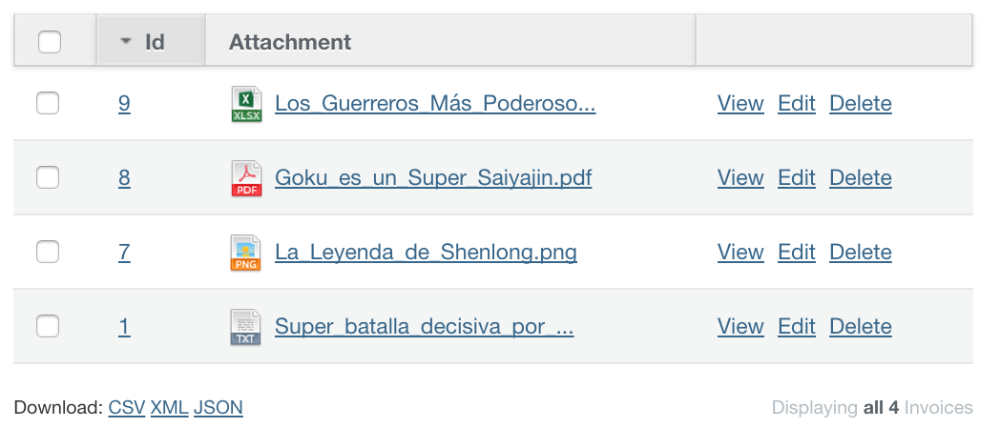

[Read more!](docs/paperclip_attachment.md)

#### Images

Display images in the index and show views. This implementation supports [Shrine](https://github.com/shrinerb/shrine) and [Paperclip](https://github.com/thoughtbot/paperclip).

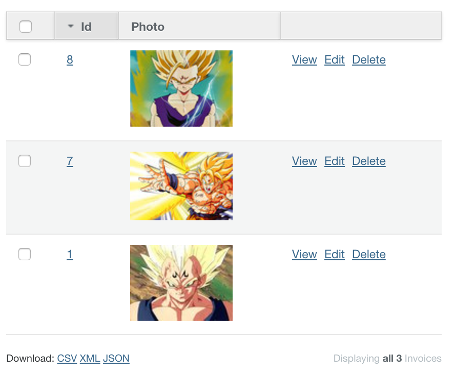

[Read more!](docs/images.md)

#### AASM Integration

You can show [aasm](https://github.com/aasm/aasm) values as active admin tags.

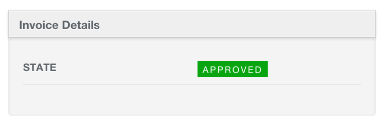

[Read more!](docs/aasm_integration.md)

#### Enumerize and Rails Enum Integration

You can show Rails' built in `enums` or [enumerize](https://github.com/brainspec/enumerize) values as active admin tags.

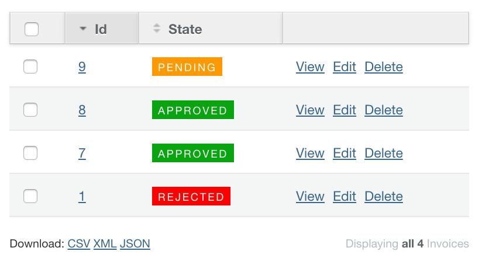

[Read more!](docs/enum_integration.md)

#### Boolean Values

Modifies how boolean values are displayed.

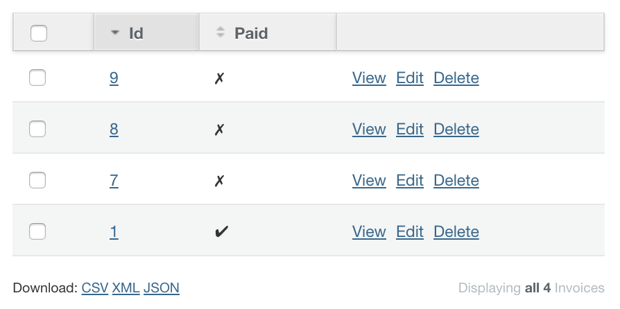

[Read more!](docs/boolean_values.md)

#### Toggleable Boolean Columns

Have switches to toggle values directly at the index

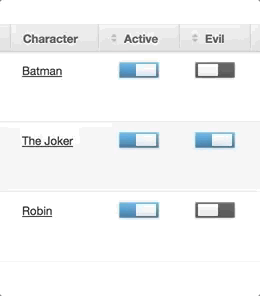

[Read more!](docs/toggle_bool.md)

#### Number Formatting

You can show numbers with format supported by [Rails NumberHelper](http://apidock.com/rails/v4.2.1/ActionView/Helpers/NumberHelper)

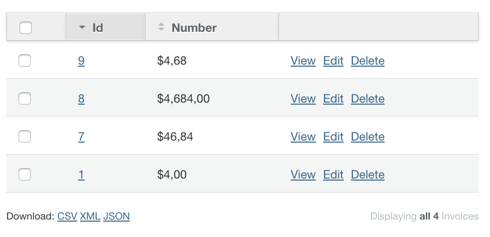

[Read more!](docs/number-formatting.md)

#### List

You can show `Array` or `Hash` values as html lists.

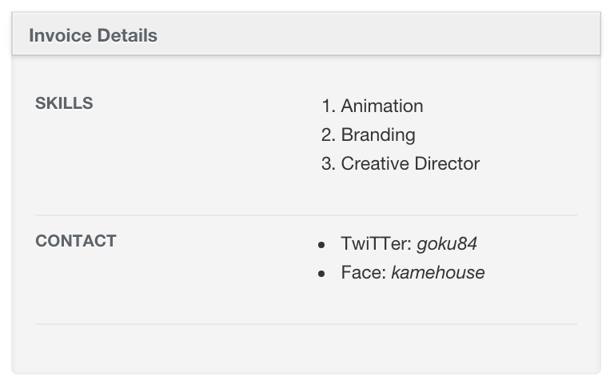

[Read more!](docs/list.md)

### Inputs

#### Select2 Input

With [select2](http://ivaynberg.github.io/select2/) the select control looks nicer, it works great with large collections.

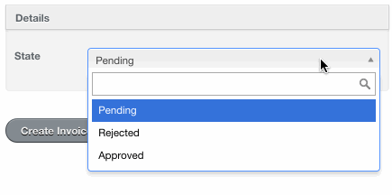

[Read more!](docs/select2_default.md)

#### Tag Input

Using tags input, you can add tags using select2.

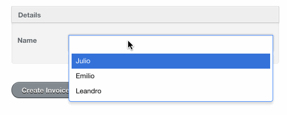

[Read more!](docs/select2_tags.md)

#### Selected List Input

This form control allows you to handle your many to many associations.

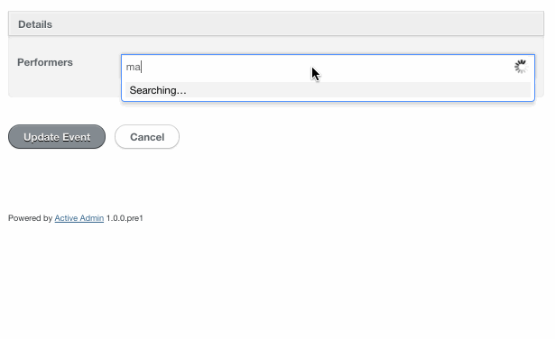

[Read more!](docs/select2_selected_list.md)

#### Search Select Input

Using `search_select` input, you can easily add ajax search to activeadmin.

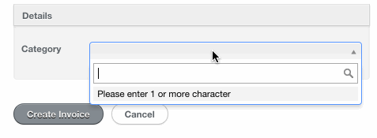

[Read more!](docs/select2_search.md)

#### Nested Select Input

Using `nested_select` input, you can build related select inputs.

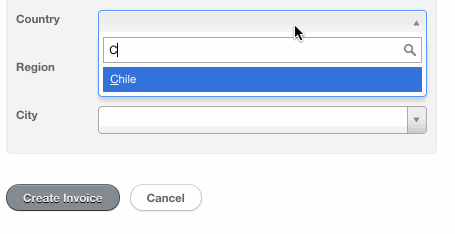

[Read more!](docs/select2_nested_select.md)

### Color Picker Input

You can pick colors using [JQuery Palette Color Picker](https://github.com/carloscabo/jquery-palette-color-picker)

```ruby
f.input :color, as: :color_picker
```

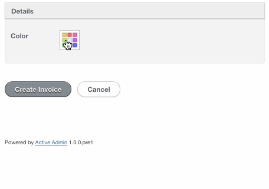

[Read more!](docs/color-picker.md)

### Date Time Picker Input

You can pick dates with time using the xdan's [jQuery Plugin Date and Time Picker](https://github.com/xdan/datetimepicker)

```ruby
f.input :updated_at, as: :date_time_picker
```

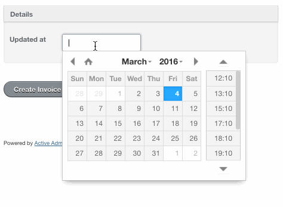

[Read more!](docs/date-time-picker.md)

### Filters

#### Numeric Range Filter

To filter based on a range of values you can use `numeric_range_filter` like this:

```ruby
filter :number, as: :numeric_range_filter
```

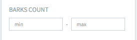

#### Date Time Picker Filter

To filter based on a range of datetimes you can use `date_time_picker_filter` like this:

```ruby
filter :created_at, as: :date_time_picker_filter
```

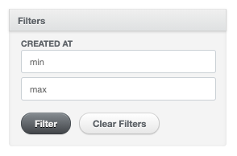

#### Search Select Filter

You can use the ajax select input to filter values on index view like this:

```ruby
filter :category_id, as: :search_select_filter
```

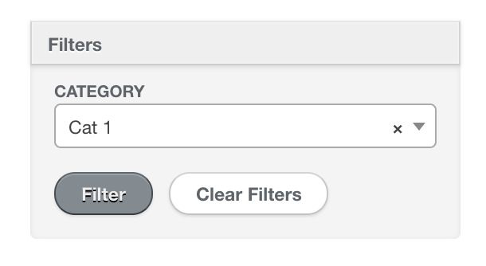

### Themes

#### NO Theme
Use default active_admin theme.

#### Material Theme
##### Not compatible when Active Admin has been installed in webpack mode

Show material design theme using [active_material](https://github.com/vigetlabs/active_material). If you want to use it, you should run the generator using the flag `theme` as follow:

```ruby
rails g activeadmin_addons:install --theme material
```

Also, you can modify primary color, and all other theme colors, in the first lines of the file: ` app/assets/stylesheets/active_admin.scss`
```scss
$am-theme-primary: YOUR-COLOR;
...
other colors
...
@import 'activeadmin_addons/material';
```

Take care of defining these variables before the import of `@import 'activeadmin_addons/material';`.

For material documentation you should go to [gem documentation](http://code.viget.com/active_material/docs/api/).

## Publishing

On master/main branch...

1. Change `VERSION` in `lib/activeadmin_addons/version.rb`.
2. Change `Unreleased` title to current version in `CHANGELOG.md`.
3. Run `bundle install`.
4. Commit new release. For example: `Releasing v1.0.0`.
5. Create tag. For example: `git tag v1.0.0`.
6. Push tag. For example: `git push origin v1.0.0`.

## Contributing

1. Fork it
2. Create your feature branch (`git checkout -b my-new-feature`)
3. If you changed the javascript/scss files, run `yarn build`.
4. Commit your changes (`git commit -am 'Add some feature'`)
5. Push to the branch (`git push origin my-new-feature`)
6. Create new Pull Request

If you want to collaborate, please check [the rules](docs/CONTRIBUTING.md) first.

## Credits

Thank you [contributors](https://github.com/platanus/activeadmin_addons/graphs/contributors)!


activeadmin_addons is maintained by [platanus](http://platan.us).

## License

ActiveAdminAddons is © 2021 Platanus, spa. It is free software and may be redistributed under the terms specified in the LICENSE file.
