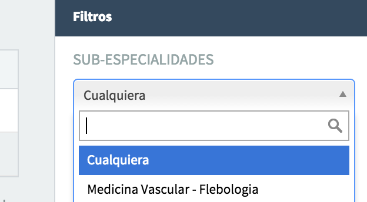
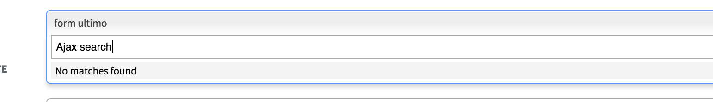
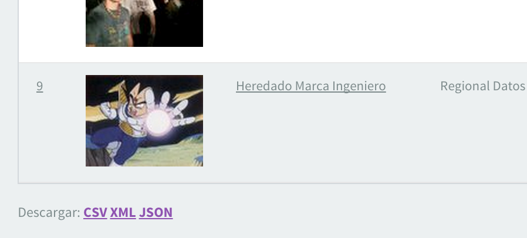
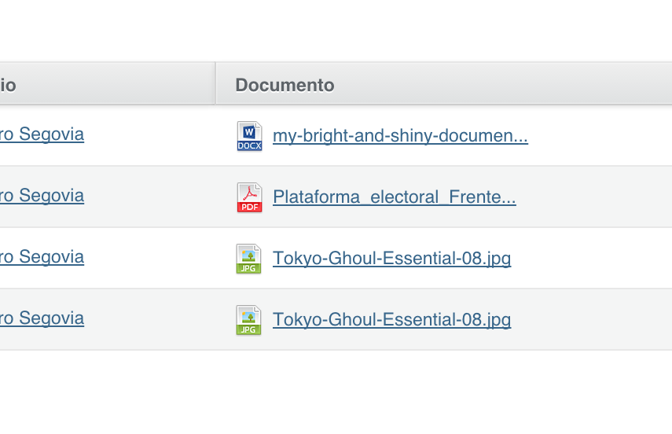
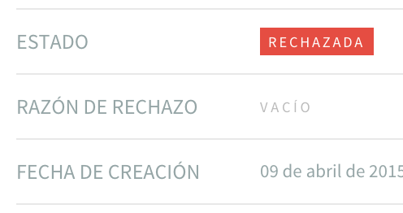
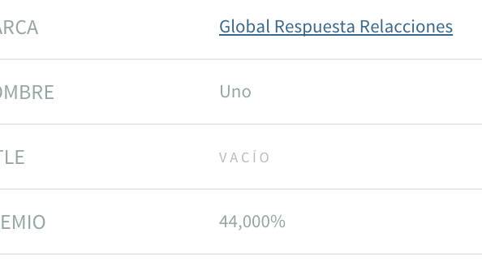

# ActiveAdmin Addons

Set of addons to help with the activeadmin ui

## Instalation

Add this line to your application's Gemfile:

```ruby
gem 'activeadmin_addons'
```

And then execute:

```bash
$ bundle
```

## Setup

The **first** line in `app/assets/stylesheets/active_admin.css.scss` should be:

```stylesheet
//= require activeadmin_addons/all
```

In `app/assets/javascripts/active_admin.js.coffee` add this line **after** `#= require active_admin/base`

```javascript
#= require activeadmin_addons/all
```

## Default behaviour Changes

Installing this gem...

* The default date input will be `:datepicker` instead of `:date_select`
* Add better integration with [enumerize](https://github.com/brainspec/enumerize) on filters and selects

## Addons

### Filters

#### Range Filter

To filter based on a range of values you can use `range_select` like this:

```ruby
filter :barks_count, as: :range_select
```


### Boolean values

#### Bool Row

Modifies how boolean values are displayed in attributes_table control (the one used in show view)

| key | value |
|------|------|
| paid | &#x2717; |
| subscribed | &#x2714; |

[Read more!](docs/bool_row.md)

#### Bool Column

Modifies how boolean values are displayed in index view

| id | name | paid | subscribed |
|------|------|------|------|
| 123 | Felipe | &#x2717; | &#x2714; |

[Read more!](docs/bool_column.md)

### Select2

#### Default

With [select2](http://ivaynberg.github.io/select2/) the select control looks nicer, it works great with large collections and multiple selection.



[Read more!](docs/select2_default.md)

#### Tagging

Using tags input, you can add tags using select2.


[Read more!](docs/select2_tags.md)

#### Ajax Search

Using `search_select` input, you can easly add ajax search to activeadmin



[Read more!](docs/select2_search.md)

### Paperclip Integration

#### For Images

Displays a paperclip image into index and show views.



[Read more!](docs/paperclip_images.md)

#### For Any Attachment

Displays a paperclip link with attachment related icon into index and show views.



[Read more!](docs/paperclip_attachment.md)

### Enum Integration

You can show Rails' built in `enums` or [enumerize](https://github.com/brainspec/enumerize) values as active admin tags.



[Read more!](docs/enumerize_integration.md)

### Number Formatting

You can show numbers with format supported by [Rails NumberHelper](http://apidock.com/rails/v4.2.1/ActionView/Helpers/NumberHelper)



[Read more!](docs/number.md)

### List

You can show `Array` or `Hash` values as html lists.


[Read more!](docs/list.md)

## Contributing

1. Fork it
2. Create your feature branch (`git checkout -b my-new-feature`)
3. Commit your changes (`git commit -am 'Add some feature'`)
4. Push to the branch (`git push origin my-new-feature`)
5. Create new Pull Request

## Credits

Thank you [contributors](https://github.com/platanus/activeadmin_addons/graphs/contributors)!


activeadmin_addons is maintained by [platanus](http://platan.us).

## License

ActiveAdminAddons is © 2015 Platanus, spa. It is free software and may be redistributed under the terms specified in the LICENSE file.
