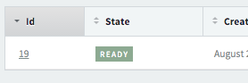

### AASM Integration

#### State Row

```ruby
show do
  attributes_table do
    # another attribute...
    state_row :state
  end
end
```


#### State Column

```ruby
index do
  # another attribute...
  state_column :state
end
```



The name of the state will be the class name (rejected approved etc), but you can pass a hash of options to map different states with tag colors

```ruby
state_column(:state, states: { destroyed: "rejected" })
```

You will need to define inside `your_app/app/assets/stylesheets/active_admin.css.scss` the following:

```scss
.status_tag {
  &.rejected { background: $rejected-color; }
  &.approved { background: $approved-color; }
}
```
