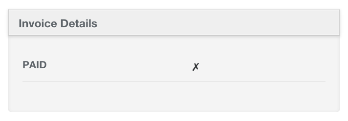
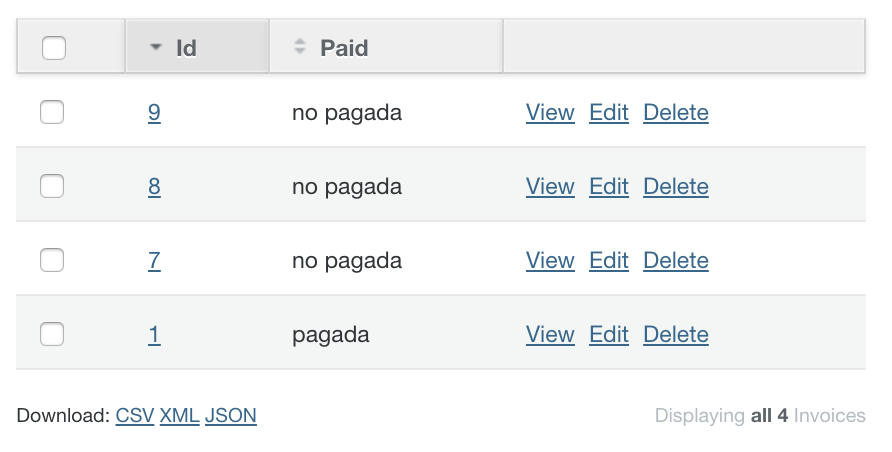

# Boolean values

## Bool Row

Modifies how boolean values are displayed in `attributes_table` control (the one used in show view)



You just need to use `bool_row` method

```ruby
show do
  attributes_table do
    bool_row :paid
  end
end
```

## Bool Column

Modifies how boolean values are displayed in index view


You just need to use `bool_column` method

```ruby
index do
  bool_column :paid
end
```

## Style

You can set your own style for boolean values, adding the following code to `active_admin.scss` file.

```scss
.bool-value {
  font-size: 12px;

  &.true-value {
    color: #08A510;
  }

  &.false-value {
    color: #FF0000;
  }
}
```

## i18n Support

### The default values are:

* true: &#x2714;
* false: &#x2717;

### Modifing the default

```
es:
  activeadmin:
    addons:
      boolean:
        default:
          true_value: pagada
          false_value: no pagada
```

### Modifing a specific model

```
es:
  activeadmin:
    addons:
      boolean:
        models:
          invoice:
            true_value: pagada
            false_value: no pagada
```

### Modifing an specific model attribute

```
es:
  activeadmin:
    addons:
      boolean:
        models:
          invoice:
            paid:
              true_value: pagada
              false_value: no pagada
```


