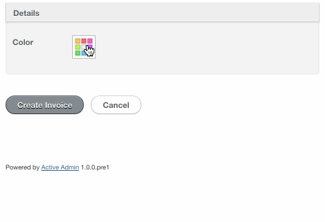

# Color Picker

## Form

You can pick colors using [JQuery Palette Color Picker](https://github.com/carloscabo/jquery-palette-color-picker)

```ruby
form do |f|
  f.inputs "Details" do
    f.input :color, as: :color_picker
  end

  f.actions
```


## Options

* `palette`: If you don't want default, you can pass your own colors:

```ruby
form do |f|
  f.inputs "Details" do
    f.input :color, as: :color_picker, palette: ["#DD2900","#D94000","#D55500","#D26A00","#CE7D00","#CA9000","#C6A300","#C2B400","#B9BF00"]
  end

  f.actions
```


