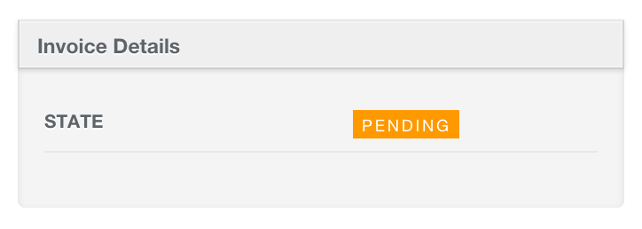
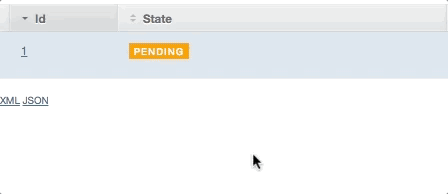

# Enum Integration

## Tag Row

```ruby
show do
  attributes_table do
    tag_row :state
  end
end
```



## Tag Column

```ruby
index do
  tag_column :state
end
```


If you want to customize the tag's colors. You need to define css classes matching enumerize attribute values. For example: if you have the `Bill` model with:

```ruby
class Bill < ActiveRecord::Base
  # Enumerize
  extend Enumerize
  enumerize :state, in: [:pending, :rejected, :approved], default: :pending

  # Rails Enum
  enum status: { active: 0, archived: 1 }
end
```

You will need to define inside `your_app/app/assets/stylesheets/active_admin.css.scss` the following:

```scss
$pending-color: #FF9900;
$rejected-color: #FF0000;
$approved-color: #08A510;

.status_tag {
  &.pending { background: $pending-color; }
  &.rejected { background: $rejected-color; }
  &.approved { background: $approved-color; }
}
```

## Interactive Tag Column

`tag_column` also can receive the boolean parameter `interactive`. If `interactive` is true, it will render a select2 input to change the value of the attribute when the tag is clicked:

```ruby
index do
  tag_column :state, interactive: true
  tag_column :status, interactive: true
end
```



### Important

If you have:

```ruby
ActiveAdmin.register Invoice do
  index do
    tag_column :state, interactive: true
  end
end
```

By using the toggle button, you'll make a request to `PATCH /admin/invoices/:id`. Because of this, you will need to have the show and update actions activated on `admin/invoices.rb`.

```ruby
ActiveAdmin.register Invoice do
  actions :show, :update # if you remove this line, all CRUD actions will be enabled. So, don't do something like this: `actions :index` or the interactive feature won't work.

  index do
    tag_column :state, interactive: true
  end
end
```

