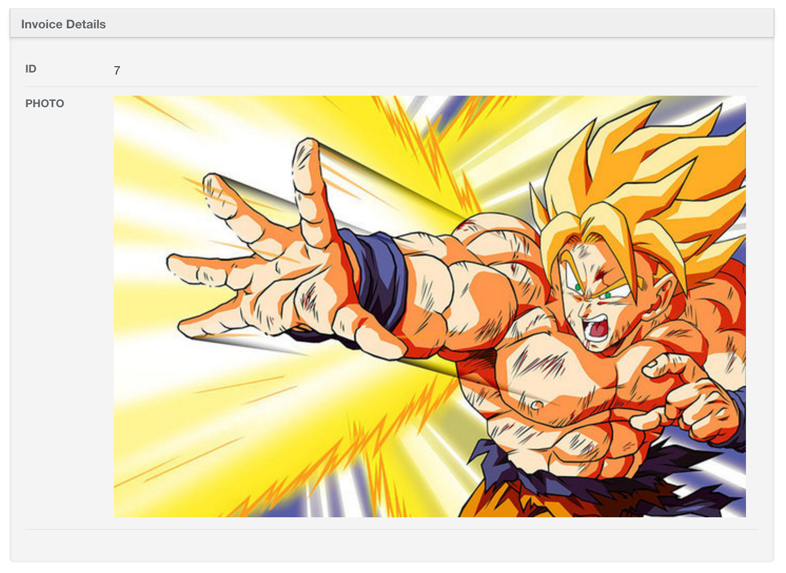

# Images Integration

## Shrine

### Image Row

The Shrine implementation receives an optional `image_options` which is then used as the options for the [`image_tag`](https://apidock.com/rails/ActionView/Helpers/AssetTagHelper/image_tag) method.
```ruby
show do
  attributes_table do
    image_row :photo, image_options: { width: 400 }
  end
end
```



### Image Column

To use the Shrine [derivatives](https://shrinerb.com/docs/plugins/derivatives) you can use the `style` option with the name of the derivative like the example below. In this case you would need to have a derivative created with the `'jpg_small'` name.
```ruby
index do
  image_column :photo, style: :jpg_small
end
```


