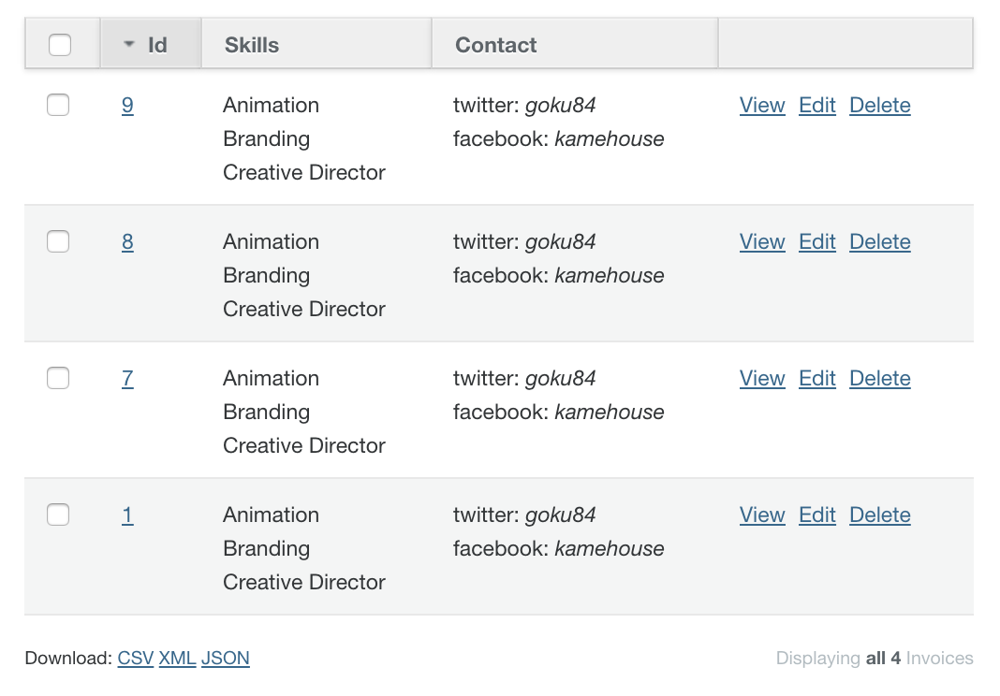

# List

`list_[row|column]` takes as first param an attribute (or method) that must return an `Array` or `Hash`. For example:

```ruby
resource.skills
#=> ["Animation", "Branding", "Creative Director"]
resource.contact
#=> { "twitter" => "goku84", "facebook" => "kamehouse" }
```

## List Row

```ruby
show do
  attributes_table do
    list_row :skills, list_type: :ol
    list_row :contact, localize: true
  end
end
```


## List Column

```ruby
index do
  list_column :skills
  list_column :contact
end
```



## Options

* `localize`: allows you to translate array values or hash keys using the following structure:

```yaml
[languaje]:
  addons_list:
    [model_name]:
      [method]:
        key1: value1
        key2: value2
```

```yaml
es:
  addons_list:
    resource:
      contact:
        twitter: TwiTTer
        facebook: Face
```

* `list_type`: allows you to pick between `:ul` (unordered list) and `:ol` (ordered list) types.
