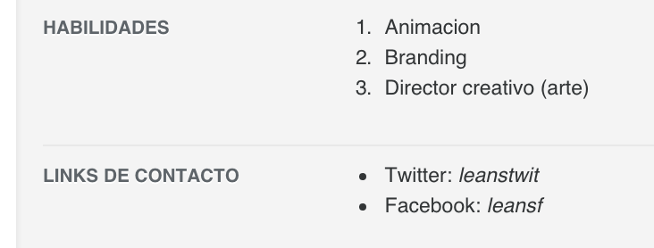
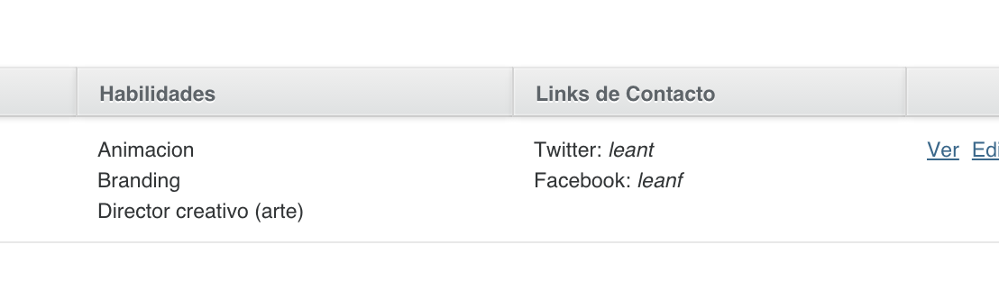

### List

`list_[row|column]` takes as first param an attribute (or method) that must return an `Array` or `Hash`. Por example:

```ruby
user.abilities
#=> ["animation", "branding", "creative_director_art"]
user.contact
#=> {"twitter"=>"leanstwit", "facebook"=>"leansf"}
```

#### List Row

```ruby
show do
  attributes_table do
    # another attributes...
    list_row :abilities, localize: true
    list_row :contact, localize: true
  end
end
```



#### List Column

```ruby
index do
  # another attributes...
  list_row :abilities, localize: true, list_type: :ol
  list_row :contact, localize: true
end
```



#### Options

* `localize`: allows you to translate array values or hash keys using the following structure:

```yaml
[languaje]:
  addons_list:
    [model_name]:
      [method]:
        key1: value1
        key2: value2
```

```yaml
es:
  addons_list:
    user:
      abilities:
        graphic_artist: Artista gráfico
        multimedia_artist: Artista multimedia
```

* `list_type`: allows you to pick between `:ul` (unordered list) and `:ol` (ordered list) types.
