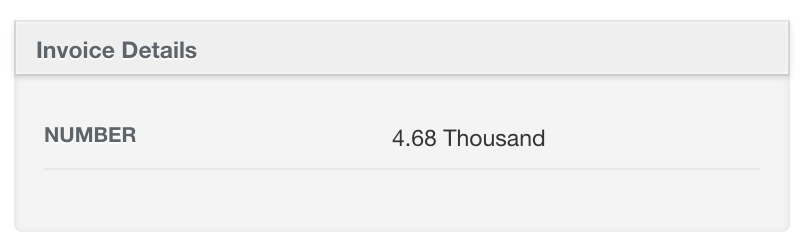

# Number Formatting

## Number Row

```ruby
show do
  attributes_table do
    number_row :number, as: :human
  end
end
```



## Number Column

```ruby
index do
  number_column :number, as: :currency, unit: "$", separator: ","
end
```


## Options

If you want to customize the default number format, you can pass the same options passed to [Rails NumberHelper](http://apidock.com/rails/v4.2.1/ActionView/Helpers/NumberHelper) methods.
