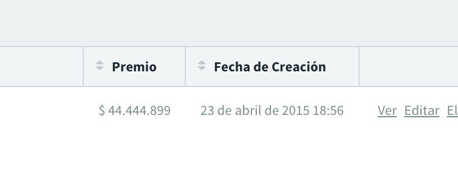

### Number Formatting

#### Number Row

```ruby
show do
  attributes_table do
    # another attributes...
    number_row :amount, as: :currency
  end
end
```



#### Number Column

```ruby
index do
  # another attributes...
  number_row :profit, as: :percentage
end
```


#### Options

If you want to customize the default number format, you can pass the same options passed to [Rails NumberHelper](http://apidock.com/rails/v4.2.1/ActionView/Helpers/NumberHelper) methods. For example:

```ruby
show do
  attributes_table do
    # another attributes...
    number_row :amount, as: :currency, unit: "R$", separator: ","
  end
end
```
