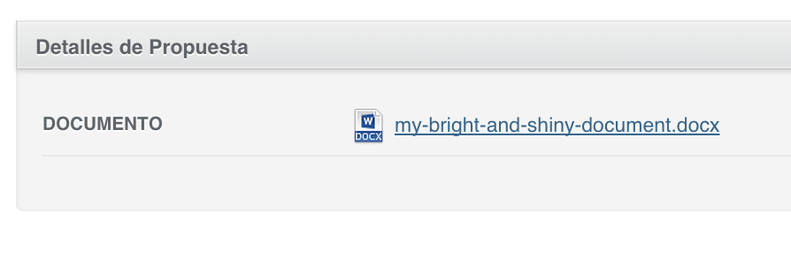

### Paperclip Integration

#### Attachment Row

```ruby
show do
  attributes_table do
    # another attributes...
    attachment_row :document, label: "Download this"
  end
end
```



#### Attachment Column

```ruby
index do
  # another attributes...
  attachment_column :document, truncate: false
end
```


#### Options

* You can pass `truncate` attribute to toggle truncating the filename. `attachment_column` truncates by default, while `attachment_row` doesn't
* Pass `label` if you want to show another text instead of the filename
