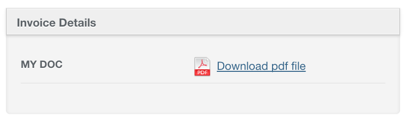

# Paperclip Integration

## Attachment Row

```ruby
show do
  attributes_table do
    attachment_row("My doc", :attachment, label: 'Download pdf file', truncate: false)
  end
end
```



## Attachment Column

```ruby
index do
  attachment_column :document
end
```


## Options

* `truncate`: you can pass `truncate` attribute to toggle truncating the filename. `attachment_column` truncates by default.
* `label`: if you want to show another text instead of the filename.
It can be a string, or a proc if you need another attribute from the model
`attachment_column "Who wrote it", :pdf_file, label: proc { |book| book.author.name }`
