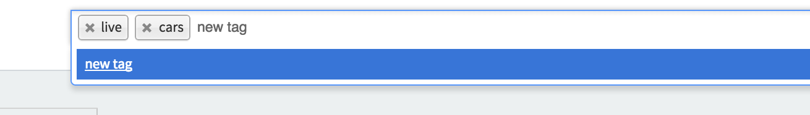

### Select2

#### Tagging

To enable select2 with tags functionality you need to do the following:

```ruby
f.input :hobbies, as: :tags
```

You can load previous created tags using `collection` option passing an array of strings like this:

```ruby
f.input :hobbies, as: :tags, collection: ['Playing guitar', 'Watching Game of Thrones']
```


