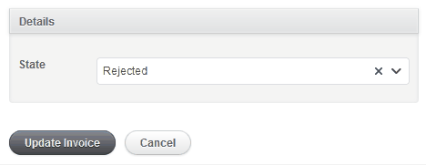

# Slim Select

## Default

As default behavior, all select controls in your admin app will be wrapped by [Slim Select](https://slimselectjs.com/).



If you don't want to use it in a specific control, just add the `"default-select"` class:

```
f.input :created_at, input_html: { class: "default-select" }
```

If you don't want all the select controls wrapped by slim select, you can change the default behavior setting as `"default"` the `default_select` option in the initializer.

```ruby
ActiveadminAddons.setup do |config|
  config.default_select = "default"
end
```

Now, if you want to enable [Slim Select](https://slimselectjs.com/) for a single control, you can add the `"slim-select"` class:

```
f.input :created_at, input_html: { class: ""slim-select" }
```

### Options

* `tags`: **(optional)** boolean option, by **default** it's `false`. If `true`, it allows dynamic option creation [as described here](https://slimselectjs.com/events#addable). It will also add the input's initial value to the select options if it's not in the supplied collection. Note that, unlike the `tags_input`, this does not allow multiple values. Only available for form inputs, not filters.
