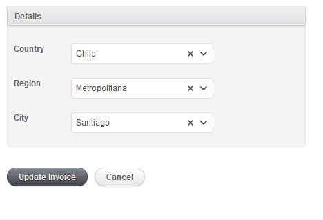
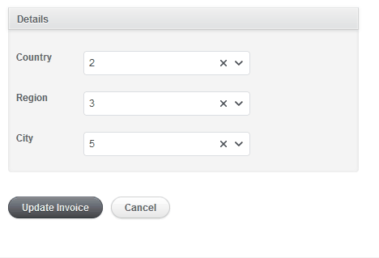
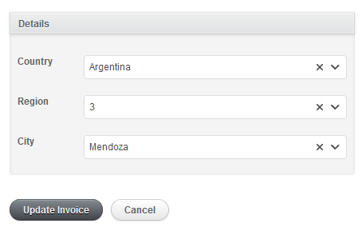

# Slim Select

## Nested Select

Lets say you have the following Active Record models

```ruby
class Country < ActiveRecord::Base
end

class Region < ActiveRecord::Base
  belongs_to :country
end

class City < ActiveRecord::Base
  belongs_to :region
end
```

And the following Active Admin pages:

```ruby
ActiveAdmin.register Country do
  permit_params :name
end

ActiveAdmin.register Region do
  permit_params :name, :country_id
end

ActiveAdmin.register City do
  permit_params :name, :region_id
end
```

to enable nested select functionality, you we'll need to do the following:

```ruby
f.input :city, as: :nested_select,
               level_1: { attribute: :country },
               level_2: { attribute: :region },
               level_3: { attribute: :city }
```



By default, the nested select input uses the index action of the different levels to get the data. For example, the level 2 (region) will perform an ajax request to `/admin/regions&country_id_eq=[selected_country_id]` to get the regions for a given country.
It's not mandatory to register the ActiveAdmin pages. But, if you don't, you'll need to pass the `url` attribute, on each level, to make it work.

```ruby
f.input :city, as: :nested_select,
               level_1: {
                 attribute: :country,
                 url: '/api/countries'
               },
               level_2: {
                 attribute: :region,
                 url: '/api/regions'
               },
               level_3: {
                 attribute: :city,
                 url: '/api/cities'
               }
```

> Remember: those custom endpoints need to work with Ransack filters.

Another option is to pass the `collection` attribute. If you set this, the `url` attribute will be ignored (no ajax request will be executed) and you will work with preloaded collections.

```ruby
f.input :city, as: :nested_select,
               level_1: {
                 attribute: :country,
                 collection: Country.all
               },
               level_2: {
                 attribute: :region,
                 collection: Region.active
               },
               level_3: {
                 attribute: :city,
                 collection: City.all
               }
```

### Options

Nested select, allows you to customize the general behavior of the input:

* `fields`: **(optional)** An array of field names where to search for matches in the related model. If we give many fields, they will be searched with an OR condition.
* `display_name`: **(optional)** You can pass an optional `display_name` to set the attribute (or method) to show results on the select. It **defaults to**: `name`
* `minimum_input_length`: **(optional)** Minimum number of characters required to initiate the search. It **defaults to**: `1`. Set this value to `0` to disable type-to-search and show a static list.
* `response_root`: **(optional)** If you have defined the `url` attribute and a request to that url responds with a root, you can indicate the name of that root with this attribute. By default, the gem will try to infer the root from the name of the input. If you have a rootless api, you don't need to worry about this attribute.
* `predicate`: **(optional)** You can change the default [ransack predicate](https://github.com/activerecord-hackery/ransack#search-matchers). It **defaults to** `cont`

```ruby
f.input :city, as: :nested_select,
               fields: [:name, :id],
               display_name: :id,
               minimum_input_length: 1,
               level_1: { attribute: :country },
               level_2: { attribute: :region },
               level_3: { attribute: :city }
```



Also, you can redefine general options on each level.

```ruby
f.input :city, as: :nested_select,
               fields: [:name],
               display_name: :name,
               minimum_input_length: 0,
               level_1: {
                 attribute: :country,
                 minimum_input_length: 3,
                 url: '/api/countries',
                 response_root: 'paises'
               },
               level_2: {
                 attribute: :region,
                 display_name: :id,
               },
               level_3: {
                 attribute: :city,
                 fields: [:name, :information]
               }
```

> `response_root` is not valid as general configuration. You need to define this attribute by level.



If you are using ajax search, you can define custom filters. For example, if you have:

```ruby
f.input :city, as: :nested_select,
               level_1: { attribute: :country },
               level_2: {
                 attribute: :region,
                 filters: { name_cont: "Cuy", id_gt: 22 }
               },
               level_3: { attribute: :city }
```

After selecting a country, the regions will be filtered by:

* The selected country id.
* The text entered in the region's input.
* **All filters passed on `:filters` attribute. Each filter needs to be a key (Ransak gem style) with a value.**
