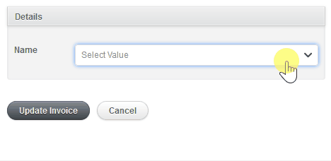

# Slim Select

## Tagging

To allow selecting multiple values, you can use the `:tags` input type:

```ruby
f.input :names, as: :tags
```

You can load previously created tags using `collection` option passing an array of strings like this:

```ruby
f.input :names, as: :tags, collection: ['Diego', 'Leandro', 'Guillermo']
```



## Tagging with Active Record collections

To use tagging functionality with Active Record collections you need to do something like this:

```ruby
class Event < ActiveRecord::Base
  has_and_belongs_to_many :performers
end

class Performer < ActiveRecord::Base
  has_and_belongs_to_many :events
end
```

So, in the ActiveAdmin's Event form, you can add:

```ruby
f.input :performer_ids, as: :tags, collection: Performer.all, display_name: :full_name
```

> Remember: the input name must be: `performer_ids` not `performers`.

## :warning: Gotchas

Note that this input type uses a regular select with `multiple: true` under the hood. As such, it also returns an array of string, so **remember to add your attribute as an array to the permitted_params**, such as `performer_ids: []`.

Moreover, this input is subject to [this same limitation](https://edgeapi.rubyonrails.org/classes/ActionView/Helpers/FormOptionsHelper.html#:~:text=Gotcha-,The%20HTML%20specification,-says%20when%20multiple) that multiple select inputs have: the returned array will always contain an empty string. When using with AR relations or something like [ActsAsTaggableOn](https://github.com/mbleigh/acts-as-taggable-on) this shouldn't be an issue, as an empty string won't trigger the creation of a new record. However, in other cases, like when using **postgres array column**, this might be a problem. Be sure to sanitize this value before saving in those cases.

## Options

* `display_name`: **(optional)** You can pass an optional `display_name` to set the attribute (or method) to show results on the select. It **defaults to**: `name`
* `value`: **(optional)** You can pass an optional `value` to set the attribute (or method) to use when an item is selected. It **defaults to**: `id`
* `width`: **(optional)** You can set the select input width (px or %).
