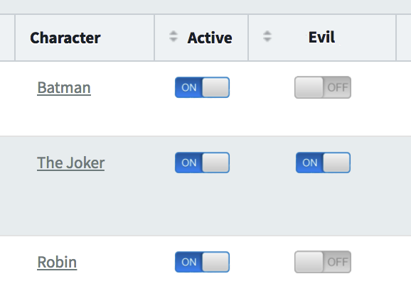

# Toggleable Bool Column


This addon features switches to toggle boolean attributes values directly at the index,
avoiding the need of going the long way through the edit view to update a record.



## Usage

Simply use `toggle_bool_column` at the index like this:

```ruby
index do
  toggle_bool_column :paid
end
```

The column label can be customized the same way as most column types:

`toggle_bool_column 'Payment OK', :paid`

### Important

Te value update is done through the default update route, so you must check you have:
 - The `update` action enabled for the admin
 - The attribute listed among the `permit_params`
 
 [Here](https://activeadmin.info/2-resource-customization.html) is described how both things go  
 
 ### Conditionally show switch
 
 In some cases we want the switch to be present not in every row, but only for certain records.
 
 Records that don't match the condition will just show nothing in this column
 
 For this use the options `if` or `unless`, like the following examples:
 
 `toggle_bool_column :paid, if: proc {|item| item.price.present? }`
 
 `toggle_bool_column :paid, unless: proc {|item| item.is_free? }`
 
 ### Notify result
 
 Optionally a js alert dialog can be prompted to the user upon update success.
 
 This is disabled by default, but can be enabled with the option `notify`
   
  `toggle_bool_column :paid, notify: true`
  
  If the update fails for any reason, an "Error: Update Failed" alert will be prompted (this can't be disabled)